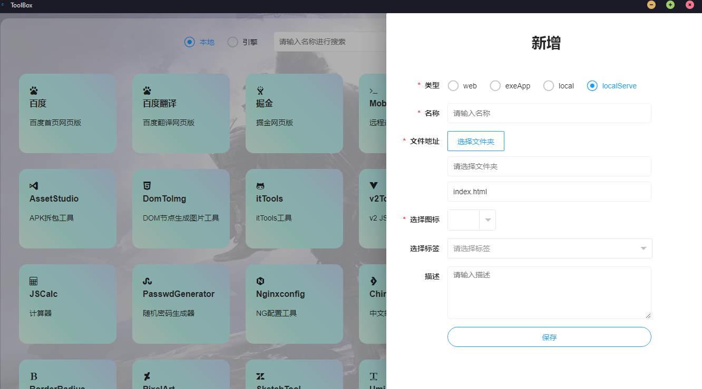
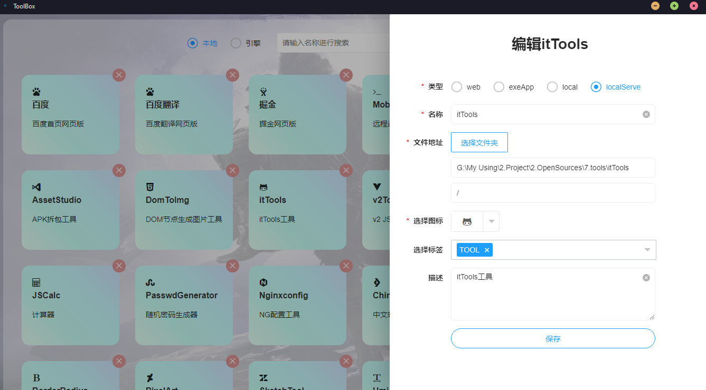
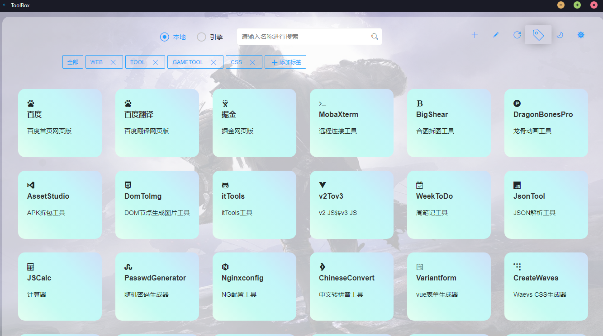
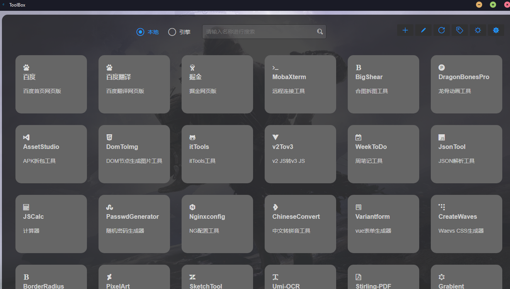
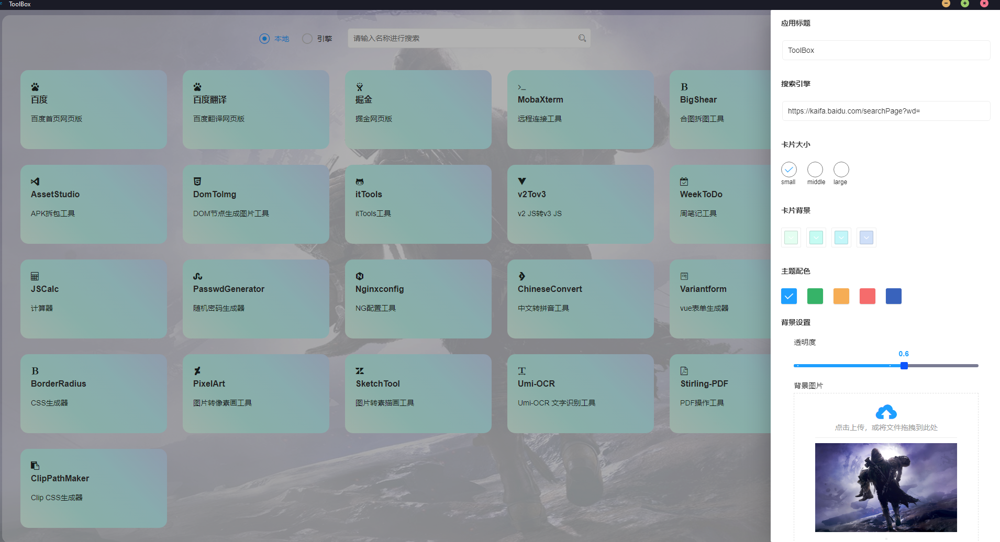
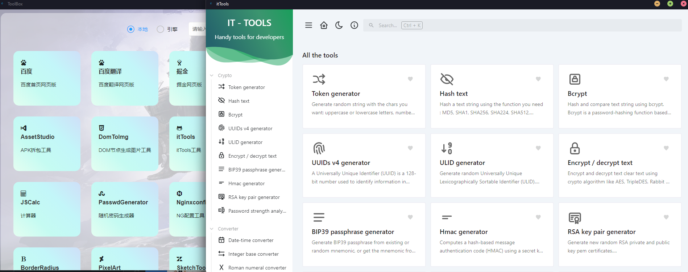

### toolBox

一款自定义导航桌面应用程序，可快速将前端工程转换成桌面应用

- 技术栈：electron，electron-forge，layui
- 功能点：
  - 导航卡片，可配置web url、本地exe可执行文件、静态文件、liveserve四种类型
  - 导航自定义标签
  - 导航样式自定义，目前只有大小和背景色
  - 主题色切换，背景透明度、图片设置，明亮、暗夜模式切换

### 功能预览









### 本地开发
#### 设置国内镜像源(加速)
```
npm config set registry=https://registry.npmmirror.com
npm config set disturl=https://registry.npmmirror.com/-/binary/node
npm config set electron_mirror=https://registry.npmmirror.com/-/binary/electron/
```

#### 安装依赖
```
npm install
```

#### 启动
```
npm run start
```

#### 打包
```
npm run package
npm run make
```

#### 初始化electron
```
npm install --save-dev electron
npm i -g @electron-forge/cli
electron-forge import
控制台中文乱码需要设置script：chcp 65001 &&
```

#### 安装asar（源代码加密）
```
npm install -D asar
```